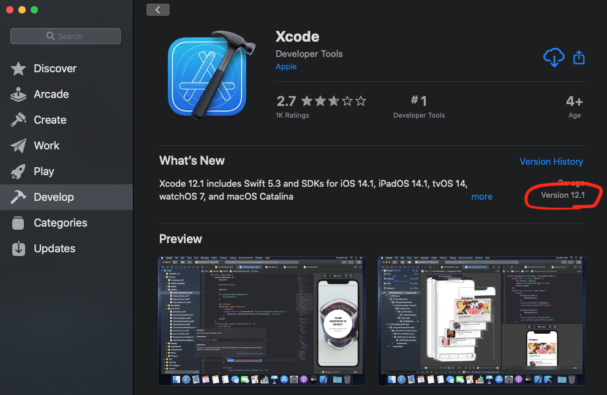
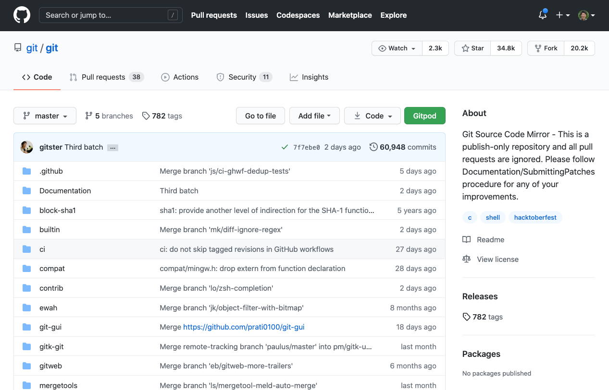
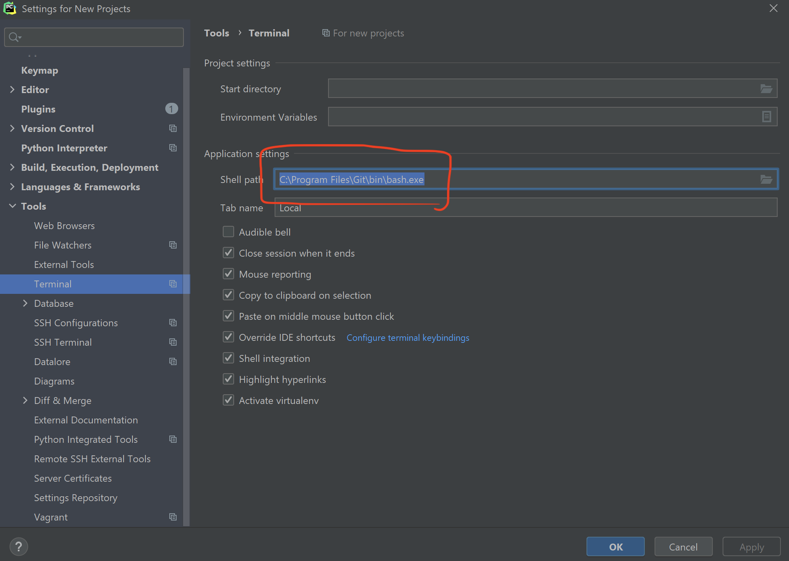
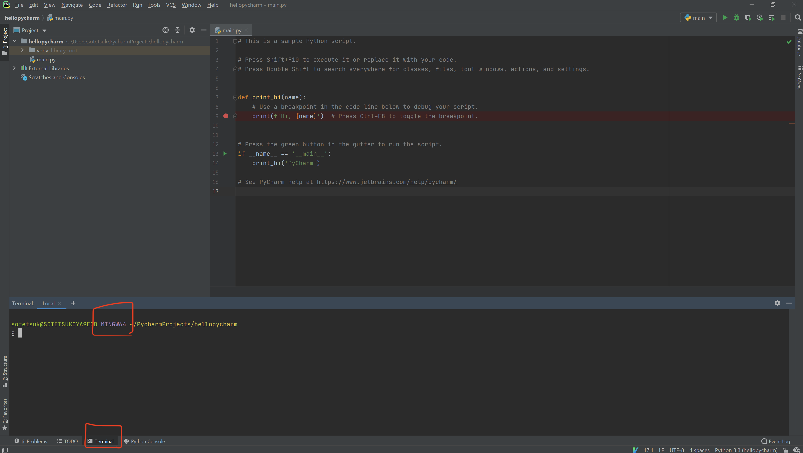

# Git入門

## :question: なぜGitを学ぶのか

App Storeに行くと、アプリケーションのバージョンが明示されています。何故でしょうか？

!!! example "身近なバージョン管理の例"
    

ソフトウェア開発において、バージョン管理は必要不可欠です。
残念ながら、多くのヒトは（本人が思っているほど）賢くありません。
例えば、プログラムを書いていると次のようなことが頻繁に起こります。

!!! bug ""
    一時間前には動いていたソースコードが、何故か今は動かないし、**この一時間の間で加えた変更の一体どこが原因かも分からない。**

!!! bug ""
    半年前に自分の書いた奇妙な修正があるが、**一体何故そんな修正をしたのか全く分からない。**

上の２つのような悲劇的な事態が一人で開発していても起こりうるわけですから、チームで開発すると事態はより一層悲壮感を増します。
こうした喜劇のような悲劇を防ぐために、バージョン管理が有効です。
バージョン管理を適切に行うと、次のようなことが可能になります。

1. 変更・更新内容に説明を加える。
2. バージョン間の違いを簡単に比較する。　
3. 不具合が発生したときに前のバージョンに戻す。
4. 違うメンバー同士がそれぞれ違う機能を同時に開発して、マージする。

そして、[**Git**](https://ja.wikipedia.org/wiki/Git)は現在最も多く使われているバージョンコントロールシステムです。
2020年現在、プログラミング言語の選択肢は数多くあれど、バージョンコントロールシステムの選択肢はGitだけと言って過言ではありません。
ここでは、Gitの使い方を学ぶことで、チームで協力して開発するための準備をします。

!!! info ""GitのGitリポジトリ""
    > [github.com/git/git](https://github.com/git/git)

    奇妙なようで当然のことですが、Gitのソースコード自体もGitを使って管理されていおり、2020年現在も更新され続けています。

    

## :computer: 事前準備（環境設定）

=== "Mac"

    1. ターミナルから `git` がインストールされていることを確認して下さい: `$ which git`
    2. もしなければ [Homebrew](https://brew.sh/) を使って `$ brew install git`

=== "Windows"
    Ubuntu上と、Windows上（とくにPyCharmから）Gitが使えるよう設定していきます。
    
    **Ubuntu**

    1. WSLのUbuntu上で `git` がインストールされていることを確認してください: `$ which git`
    2. もしなければ `$ sudo apt-get install git`

    **Windows**

    また、Ubuntu内だけでなく、PyCharm上でもGitが使えるよう[gitforwindows.org/](https://gitforwindows.org/)でインストールして下さい。
    インストール時の設定で、改行コードだけ、変換しないようにして下さい（`Checkout as-is, commit as-is` を選択）。

    また、PyCharmからGit Bashを使うよう設定して下さい。
    
    

    設定したら、プロジェクトを開いて、Git Bashが使えるようになっているか確認して下さい。

    

## :orange_book: 学習教材
どれか一つを選択してGitの基本的な操作について学習しましょう。

1. [**git入門 | ドットインストール**](https://dotinstall.com/lessons/basic_git)
2. [計算機科学実験及演習3ハードウェア「Gitの使い方」 | 京都大学情報学科計算機科学コース](http://www.lab3.kuis.kyoto-u.ac.jp/~takase/le3a/2020HW3-git.pdf)

!!! warning "デフォルトのブランチ名"

    デフォルトのブランチ名として、 `master` が広く使われてきましたが、これを `main` に変えようという流れが存在します。資料では `master` を使って説明されている箇所は、適宜 `main` に読み替えてもよいでしょう。既に、GitHub上で作成される新規のリポジトリのデフォルトのブランチ名は、特に指定をしなければ `main` となります。

    > [github.com/github/renaming](https://github.com/github/renaming)

## :white_check_mark: 習熟度チェック

!!! check "ワーキングディレクトリ | ステージングエリア | リポジトリ"

    これら3つの領域の違いを理解できているか確認しましょう。
	参考: [gitのfetchとpullの違いについて](http://www.koikikukan.com/archives/2019/02/15-000300.php)

!!! check "git pull | git fetch | git merge"

    これら3つのコマンドの動作の違いを理解できているか確認しましょう。

!!! check "Gitコマンド一覧"        
    下記表のコマンドが何をするコマンドか分かるか確認しましょう。見覚えがない場合、どんなコマンドか調べてみましょう。

| コマンド | 用途 |
|:---|:---|
| git checkout | 別のブランチへ移る。変更を取り消す。 | 
| git add | ファイルをステージングする |
| git rm | ファイルを削除し、Gitでの追跡をやめる |
| git commit | ステージングされた変更をスナップショットとして保存する |
| git push | リモートリポジトリにブランチの内容をアップロードする |
| git fetch | リモートリポジトリからブランチの内容をダウンロードする |
| git pull | リモートリポジトリからブランチの内容をダウンロードしてマージする |
| git clone | リポジトリをダウンロードする |
| git merge | あるブランチを別のブランチに統合する |
| git status | ステージされた変更、ステージされてない変更を確認する |
| git log | コミット履歴を確認する |
| git diff | 差分を表示する |
| git grep | Gitで追跡されているファイル内でgrepする |
| git stash | 変更を退避する |
| git reset | コミットされた変更を元に戻す |
| git revert | コミットの内容を打ち消すコミットをする |
| git rebase | ブランチを統合したり、コミット履歴を改変する |

!!! check "git switch | git restore"
    新しいバージョンのgitでは、`git checkout`の代わりに`git switch`と`git restore`を使うことが推奨されています。古い`git checkout`コマンドと新しい`git switch`と`git restore`の対応について調べてみましょう。

| 旧 | 新 | 用途 |
|:---|:---|:---|
| git checkout | git switch | 既存の別ブランチへと移る |
| git checkout -b | git switch -c | 新規の別ブランチへと移る |
| git checkout -- | git restore | 変更の取り消し |

## :gift: 付録

[Pro Git Book](https://git-scm.com/book/ja/v2) より詳しく正確なGitの説明はこちらを参照して下さい。
