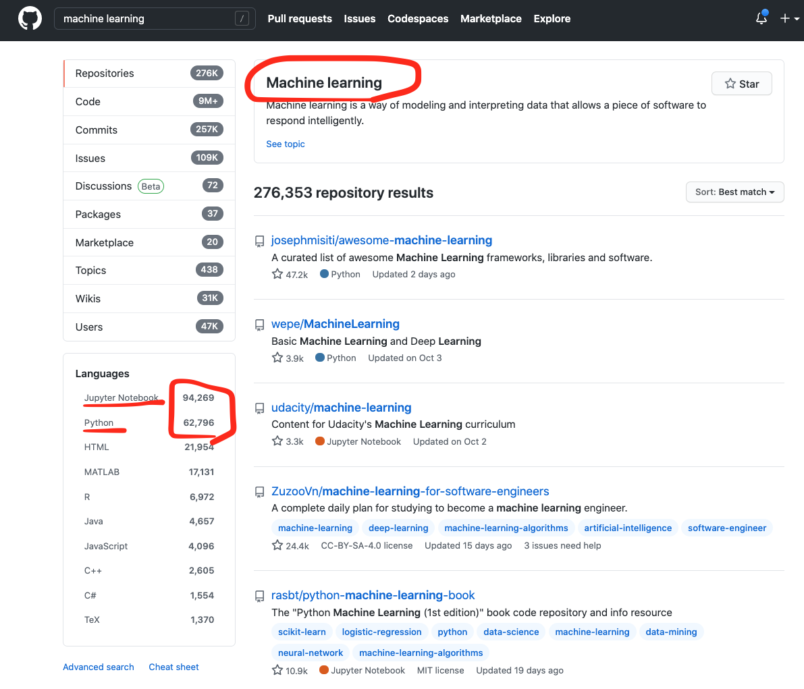
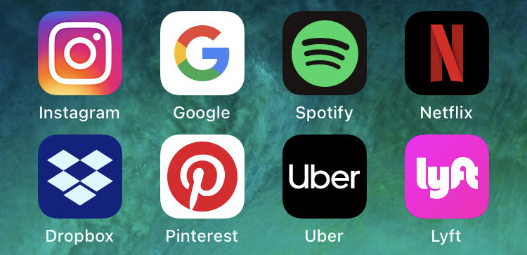

# Python文法・演習

## :question: なぜPythonを学ぶのか

様々なプログラミング言語がありますが、**Python**は今最も学ぶ価値の高い言語の一つです。Pythonは人工知能やデータサイエンスとの相性が良く、学習コストも低いため、**最初に学習するプログラミング言語として最も優れている**と言って過言でありません。実際、マサチューセッツ工科大学 (MIT) では、コンピュータサイエンス入門コースでPythonを採用しています。学習コストが低いと言っても、Pythonの機能に何か制限があるというわけではなく、**最先端の人工知能研究からWebサービスの開発に至るまで**、様々な場面で最大限に活用できます。ここでは、Pythonの基本的な文法とプログラミングの基本を学びましょう。

!!! info "Pythonと人工知能"
    GitHubにおいて、"Machine learning"で検索をすると、**PythonとJupyter Notebookで書かれたリポジトリの数が、他を圧倒しています。**
    もはや、Pythonは人工知能分野における共通言語と言っても過言ではありません。

    

!!! example "Pythonを使っている有名なサービス例"
    > [10 Famous Websites Built Using Python](https://learn.onemonth.com/10-famous-websites-built-using-python/)

    PythonはWebサービスの開発においても人気の高い言語の一つです。多くの有名サービスがPythonをバックエンドで活用しています。
    人工知能技術の産業界への輸出がこれからも続くことを考えれば、この傾向は今後も続くと予想するのが自然でしょう。

    

## :computer: 事前準備（環境設定）

Pythonを開発・実行する環境としては、ローカルマシン（自分の手元のPC）に加えて、サーバ上の[Jupyter Notebook](https://jupyter.org/)形式を選択することもできます。必要に応じてローカルマシン使い分けてみましょう。

### Google Colab

[Google Colab](https://colab.research.google.com/)はGoogleが提供するJupyter Notebook形式でのPython実行環境サービスです。Google Colabを活用すれば、環境構築の労力ゼロでPythonを使い始めることができます。特に、データの集計や可視化などの場面では、Google Colabのようなノートブック形式でPythonを実行するのが便利です。

### PyCharm
[PyCharm](https://www.jetbrains.com/ja-jp/pycharm/)はローカルマシンでの統合開発環境として最高のモノの一つです。WindowsでもMacでもPyCharmをまずインストールして下さい。ある程度規模の大きいソフトウェアの開発では、ローカルマシンで統合開発環境を使うのが必須になります。学生は無料でプロフェッショナル版を使うことができます。

- なお、学習教材で2.の東大の教材を選択する場合は、ローカルマシンの環境構築は後回しにしても問題ありません。
- モダンなPython開発環境としては、他にも[Visual Studio Code](https://code.visualstudio.com/)も選択肢に入りますが、特に設定せず最初から便利なPyCharmが初学者にはオススメです。
- WindowsではUnixコマンドの学習のときにインストールしたWSLと連携して使って下さい。[SSH を使用して WSL ベースのリモートインタープリターを作成する | PyCharm](https://pleiades.io/help/pycharm/using-wsl-as-a-remote-interpreter-1.html)

## :orange_book: 学習教材

次の教材から好きなものを選んでPythonの文法とプログラミングの基礎について勉強しましょう。**2.3.4.のどれか一つ**選択して学習してみましょう。

1. [はじめてのPython | ドットインストール](https://dotinstall.com/lessons/basic_python_v4) （有料）
    - このドットインストールのコースは90分もかからないと思うので、短時間で達成感が得られると思います。基本的にこの教材で素早く全体像を掴んでから2.3.4.のどれかで本格的に勉強していくのが良いと思います。
2. [Pythonプログラミング入門 #utpython | 東京大学 数理・情報教育研究センター ](https://sites.google.com/view/ut-python/resource/%E6%95%99%E6%9D%90%E8%AC%9B%E7%BE%A9%E5%8B%95%E7%94%BB)
    - Colab上だけで簡潔するので、Python文法やプログラミングの基礎についてのみ集中できる。
3. [プログラミング演習 Python 2019 | 京都大学学術情報リポジトリ KURENAI 紅](https://repository.kulib.kyoto-u.ac.jp/dspace/handle/2433/245698)
    - ビデオなしの教材なので、1.を勉強した後であれば適宜読み飛ばして行けると思います。GUIのプログラミングや、Tic-Tac-Toeを作るといった面白い題材が多い。
4. [Introduction to Computer Science and Programming in Python | MIT OpenCourseWare](https://ocw.mit.edu/courses/electrical-engineering-and-computer-science/6-0001-introduction-to-computer-science-and-programming-in-python-fall-2016/index.htm)
    - 英語が問題ない方はこちらがオススメです。より本格的なコンピュータサイエンス入門になっています。

## :pencil: 演習

基本的な文法やデータ構造 (`if`, `for`, `while`, `list`, `dict`, `set`, ...) が使いこなせるか確認しましょう。

[AtCoder Beginners Selection](https://atcoder.jp/contests/abs/tasks) の問題をPythonで解いてみましょう。