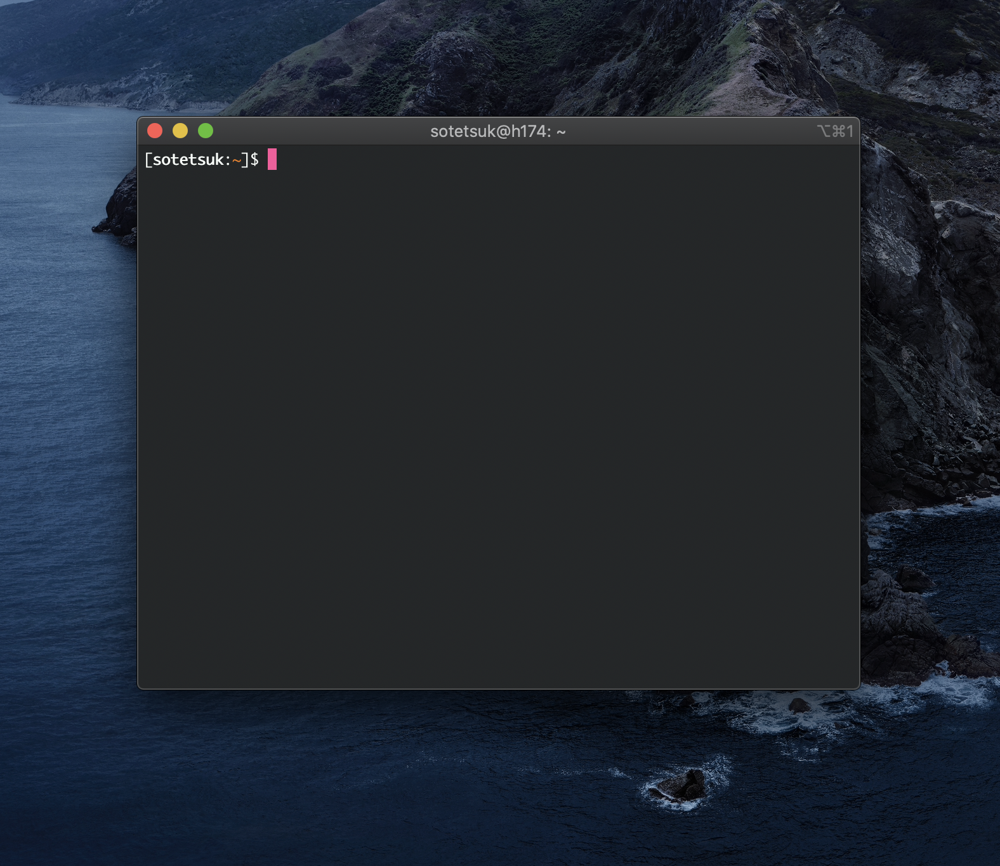

# Unixコマンド

私達がこれから開発するシステムの多くは、開発する環境がWindowsであれ、Macであれ、最終的には[サーバ](https://ja.wikipedia.org/wiki/%E3%82%B5%E3%83%BC%E3%83%90)上で稼働する場面が圧倒的に多いです。
これは大学の研究でも、会社でのシステム開発でも同じことです。
私達が慣れ親しんでいるスマホのゲームも、SNSサービスも、私達のスマホやパソコンが（アプリやブラウザを介して）サーバと情報のやり取りをしています。
そしてそれらのサーバは、[Ubuntu](https://ja.wikipedia.org/wiki/Ubuntu)のような[Linux](https://ja.wikipedia.org/wiki/Linux)ベースのOSを使うのが一般的です。
私達が普段パソコンを操作するとき、グラフィカルな画面を見ながらマウスを使って操作しているのとは対象的に、
Linuxベースのサーバでは、[CUI](https://ja.wikipedia.org/wiki/%E3%82%AD%E3%83%A3%E3%83%A9%E3%82%AF%E3%82%BF%E3%83%A6%E3%83%BC%E3%82%B6%E3%82%A4%E3%83%B3%E3%82%BF%E3%83%95%E3%82%A7%E3%83%BC%E3%82%B9)を介して操作するのが一般的ですし、（慣れていれば）効率的です。
CUIからの操作は、ターミナルから**Unixコマンド**を入力することで行います。
ここでは、基本的なUnixコマンドを学ぶことで、私達の書いたプログラムを最終的にLinuxシステム上で動作させるための準備をします。



比較的身近なLinuxサーバの例として次のようなものが挙げられます。

!!! example "スパコンシステム"

    京都大学情報学環境機構の提供するスパコンシステムは、Linuxサーバです。実際、マニュアルにはUnixコマンドの簡単なチュートリアルがあります。

    > [スーパーコンピュータシステムの使い方 | 京都大学学術情報メディアセンター](https://web.kudpc.kyoto-u.ac.jp/manual/ja)

!!! example "ソーシャルゲーム会社のサーバ構成事情"

    DeNAのような民間企業では、自社で[オンプレミス](https://ja.wikipedia.org/wiki/%E3%82%AA%E3%83%B3%E3%83%97%E3%83%AC%E3%83%9F%E3%82%B9#:~:text=%E3%82%AA%E3%83%B3%E3%83%97%E3%83%AC%E3%83%9F%E3%82%B9%EF%BC%88%E8%8B%B1%E8%AA%9E%3A%20on%2Dpremises,%E5%9E%8B%EF%BC%89%E3%81%A8%E3%82%82%E8%A8%B3%E3%81%95%E3%82%8C%E3%82%8B%E3%80%82)にサーバを用意したり、[AWS](https://aws.amazon.com/jp/)のようなクラウドサービスを利用することで、サーバを通じてユーザにサービスを提供しています。これらのサーバも基本的にLinuxサーバです。こうしたサーバのランニングコストは大きなビジネス課題となることがあります。

    > [オンプレミスに強みをもつDeNAはなぜクラウド化を決めたのか？ その舞台裏と今後の展望](https://fullswing.dena.com/archives/2638)

## :computer: 事前準備（環境設定）

### Windows

WSLを通じてWindows上でUbuntuを使いましょう。

> [Windows 10 用 Windows Subsystem for Linux のインストール ガイド](https://docs.microsoft.com/ja-jp/windows/wsl/install-win10)

### Mac

Terminalアプリを起動できればOKです。

## :orange_book: 学習教材
どちらか一つコースを選択してUnixコマンドの基本的な操作方法を学んでみましょう。

1. [UNIXコマンド入門 | ドットインストール](https://dotinstall.com/lessons/basic_unix_v3)（有料だがオススメ）
2. [はじめてのUNIXコマンド入門講座 | TechAcademy](https://www.youtube.com/watch?v=BLFPr2DsDys&list=PLjw-30bsJNVWvKT9G3n43GoeqOMmdweuQ)

## :white_check_mark: 習熟度チェック

上のコースで説明されているような、基本的かつ使用頻度の高いコマンドの使い方が分かるか確認してみましょう。
例えば、この文章の著者 (@sotetsuk) の使用頻度の高いコマンドは次のようなものでした。

```sh
history | cut -d " " -f 4 | sort | uniq -c | sort -rn | head -n 10
```

| 順位 | コマンド | 説明 |
|:---:|:---|:---|
| 1 | ls || 
| 2 | git || 
| 3 | cd|| 
| 4 | vi|| 
| 5 | cat|| 
| 6 | rm|| 
| 7 | cp|| 
| 8 | python|| 
| 9 | docker|| 
| 10 | less|| 

!!! check "使用頻度の高いコマンド"
    上記表の `git`, `python`, `docker` 以外のコマンドがどんなコマンドか分かるか確認しましょう。

!!! check ""使用頻度の高いコマンドを求めるコマンド""
    上記の使用頻度の高いコマンドを求める操作自体も、コマンドをパイプで繋げることで実現しています。それぞれのコマンドがどんなコマンドか確認してみましょう。また、パイプの使用方法を確認してみましょう。


!!! check "その他の使用頻度上位のコマンド"
    その他、@sotetsukの使用頻度上位のコマンドには次のようなものがありました。知らないコマンドがあったら、どんなコマンドか調べてみましょう。今は使い方を完璧に知らなくても、こんなコマンドがあったな、と覚えていれば必要に応じて使い方を調べて活用することができます。

**その他の使用頻度が高かったコマンドリスト**

|コマンド|説明|
|:---|:---|
| ssh || 
| mkdir|| 
| which|| 
| mv|| 
| head|| 
| tail|| 
| touch|| 
| ping|| 
| split|| 
| find|| 
| cut|| 
| awk|| 
| sed|| 


## :pencil: 演習

[自然言語処理100本ノック第二章](https://nlp100.github.io/ja/ch02.html)の問題を解いてみましょう。
この問題は、特定のUnixコマンドと同等の動作をするプログラムを実装するのが課題となっていますが、ここではUnixコマンドを使ってみるだけで十分です。